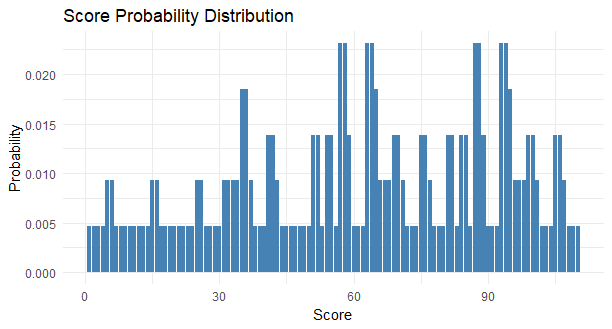

# 캡스톤디자인 1.2과제

주사위 3개를 굴려서 나온 눈의 수를 사용해서 세자리 숫자를 가장 크게 만드는 사람이 이기는 게임이다. 주사위를 처음 굴려서 나온 눈의 수를 세자리 숫자에서 어느 곳에 사용할 지 먼저 결정한다. 그런 다음 두 번째로 굴린 주사위에서 나온 눈의 수는 남은 두자리의 숫자 중 하나로 결정한다. 세 번째 나온 주사위 눈수는 자동으로 남은 숫자로 사용된다.

### 1.최선의 전략 짜기

#### 1. dice1 >= 5 이면 백의 자리, 5 > dice1 >= 3 이면 십의 자리, 3 > dice1 이면 일의 자리, dice2>=4 이면 남은 자리 중 높은 자리

#### 2. dice1 >= 5 이면 백의 자리, 5 > dice1 >= 3 이면 십의 자리, 3 > dice1 이면 일의 자리, dice2 >= 5 이면 남은 자리 중 높은 자리

#### 3. dice1 == 6 이면 백의 자리 5 > dice1 >=4 이면 십의 자리, 4 > dice1 이면 일의 자리, dice2 >= 4 이면 남은 자리 중 높은 자리


```r
three_dice <-read.csv("C:/Users/jsj99/Documents/three_dice.csv")
head(three_dice)
```

```
##   dice1 dice2 dice3
## 1     5     2     4
## 2     4     2     3
## 3     4     2     5
## 4     2     5     4
## 5     5     5     5
## 6     1     1     6
```


```r
result<- function(dice1, dice2, dice3) {
  if (dice1 >= 5) {
    if (dice2 >= 4) {
      score <- dice1 * 100 + dice2 * 10 + dice3
    } else {
      score <- dice1 * 100 + dice3 * 10 + dice2
    }
  } else if (dice1 == 3 | dice1 == 4) {
    if (dice2 >= 4) {
      score <- dice2 * 100 + dice1 * 10 + dice3
    } else {
      score <- dice3 * 100 + dice1 * 10 + dice2

    }
  } else {
    if (dice2 >= 4) {
      score <- dice2 * 100 + dice3 * 10 + dice1
    } else {
      score <- dice3 * 100 + dice2 * 10 + dice1
    }
  }
  return(score)
}
```


```r
three_dice$score <- mapply(result,three_dice$dice1, three_dice$dice2, three_dice$dice3)
sum(three_dice$score)
```

```
## [1] 503895228
```
1번 방법이 가장 총합이 높으므로 적합한 방식

```r
mean(three_dice$score)
```

```
## [1] 503.8952
```
### 2.적합한 방식일 때 확률분포 그래프

```r
dice_values <- 1:6
combinations <- expand.grid(dice1 = dice_values, dice2 = dice_values, dice3 = dice_values)
combinations$score <- mapply(result, combinations$dice1,combinations$dice2, combinations$dice3)
probability_distribution <- table(combinations$score) / nrow(combinations)
print(probability_distribution)
```

```
## 
##         111         112         121         122         131         132 
## 0.004629630 0.004629630 0.004629630 0.004629630 0.009259259 0.009259259 
##         133         141         142         143         211         212 
## 0.004629630 0.004629630 0.004629630 0.004629630 0.004629630 0.004629630 
##         221         222         231         232         233         241 
## 0.004629630 0.004629630 0.009259259 0.009259259 0.004629630 0.004629630 
##         242         243         311         312         321         322 
## 0.004629630 0.004629630 0.004629630 0.004629630 0.004629630 0.004629630 
##         331         332         333         341         342         343 
## 0.009259259 0.009259259 0.004629630 0.004629630 0.004629630 0.004629630 
##         411         412         421         422         431         432 
## 0.009259259 0.009259259 0.009259259 0.009259259 0.018518519 0.018518519 
##         433         434         435         436         441         442 
## 0.009259259 0.004629630 0.004629630 0.004629630 0.013888889 0.013888889 
##         443         444         445         446         451         452 
## 0.009259259 0.004629630 0.004629630 0.004629630 0.004629630 0.004629630 
##         461         462         511         512         513         521 
## 0.004629630 0.004629630 0.013888889 0.013888889 0.004629630 0.013888889 
##         522         523         531         532         533         534 
## 0.013888889 0.004629630 0.023148148 0.023148148 0.013888889 0.004629630 
##         535         536         541         542         543         544 
## 0.004629630 0.004629630 0.023148148 0.023148148 0.018518519 0.009259259 
##         545         546         551         552         553         554 
## 0.009259259 0.009259259 0.013888889 0.013888889 0.009259259 0.004629630 
##         555         556         561         562         563         564 
## 0.004629630 0.004629630 0.013888889 0.013888889 0.009259259 0.004629630 
##         565         566         611         612         613         621 
## 0.004629630 0.004629630 0.013888889 0.013888889 0.004629630 0.013888889 
##         622         623         631         632         633         634 
## 0.013888889 0.004629630 0.023148148 0.023148148 0.013888889 0.004629630 
##         635         636         641         642         643         644 
## 0.004629630 0.004629630 0.023148148 0.023148148 0.018518519 0.009259259 
##         645         646         651         652         653         654 
## 0.009259259 0.009259259 0.013888889 0.013888889 0.009259259 0.004629630 
##         655         656         661         662         663         664 
## 0.004629630 0.004629630 0.013888889 0.013888889 0.009259259 0.004629630 
##         665         666 
## 0.004629630 0.004629630
```

```r
df <- as.data.frame(probability_distribution)
colnames(df) <- c("score", "probability")

ggplot(df, aes(x = as.numeric(score), y = probability)) +
  geom_bar(stat = "identity", fill = "steelblue") +
  labs(title = "Score Probability Distribution", x = "Score", y = "Probability") +
  theme_minimal()
```


## 3 기대값 구하기

```r
expected_value <- sum(as.numeric(names(probability_distribution)) * probability_distribution)
cat("기대값 (Expected Value):", expected_value, "\n")
```

```
## 기대값 (Expected Value): 504
```
