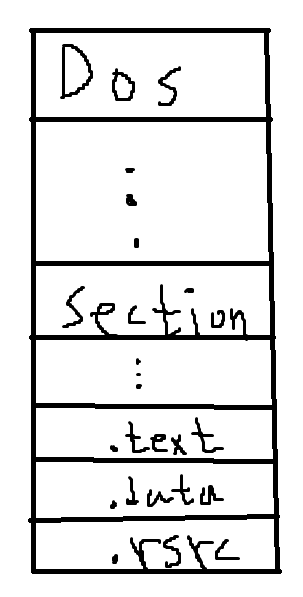
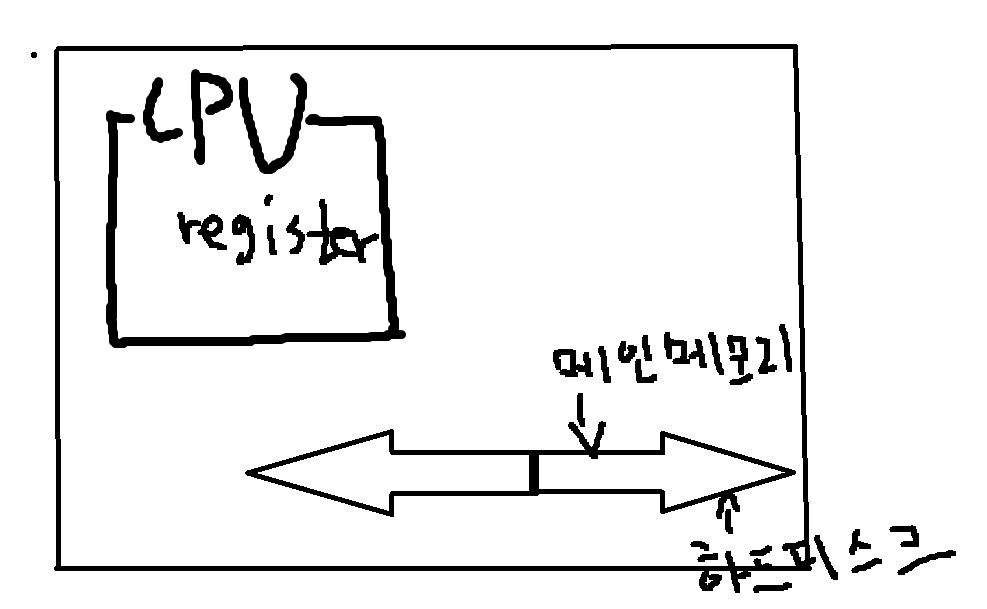
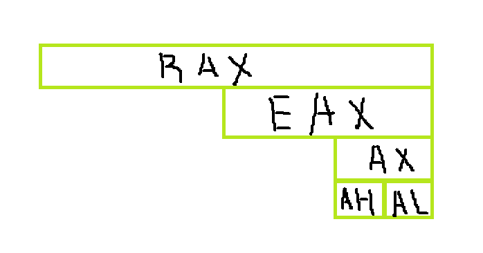

### SASM,NASM

SASM:저장할 때 exe 파일로 만들어 실행하면 내가 만든 코드 실행을 해준다.

SASM:통합 환경

NASM:어셈블리의 역할을 하게 해준다.

컴퓨터가 자기가 원하는 0101010으로 변환해서 분석해서 실행해야 하는데 우리가 만든 코드를 기계어로 변환을 해주는 작업이 필요함 그리고 그 작업을 컴파일러 혹은 어셈블리라고 한다. 그걸 해주는 게 **NASM**이다.

### 컴파일러,어셈블리

컴파일러, 어셈블리: 통역기이다. 한국인이 안녕하세요 하면 컴파일러, 어셈블리가 프랑스어로 번역해 프랑스인에게 알려주는 원리이다.

실행파일 구조를 보면

이런 식으로 되어있다.

### 메인 메모리와 하드디스크 차이

메인 메모리와 하드디스크 차이: 메인 메모리에서 저장된 데이터와 하드디스크에 저장된 데이터가 있는데 전원이 나가면 메모리에 있는 데이터는 나가고(사라지고) 하드디스크는 유지된다.

CPU에 가까울수록 빨라지는데 저장 공간은 줄어든다 그래서 속도로 보면 

Register -> 메인 메모리 -> 하드디스크 (하드디스크 쪽으로 갈수록 느려진다)

저장 공간은 반대로

하드 디스크->메모리->register(register 쪽으로 갈수록 저장 공간이 적어진다)

-register,메인 메모리,하드디스크 관계

ex) 롤이란 걸 실행할 때 하드디스크에 있는 내용을 꺼내서 메인 메모리에 복사를 한 다음 CPU랑 메인 메모리 사이를 왔다 갔다 하면서 실행한다

어셈블리어는 가장 낮은 언어이기 때문에 레지스터도 같이 작업을 하게 된다

그래서 CPU-레지스터-메인 메모리 왔다 갔다 하면서 작업을 한다.

어셈블리어 핵심요소: CPU, 레지스터, 메인 메모리

### bit,byte,word,dword,qword

비트는 0,1을 뜻하고 바이트는 비트 하나가 8개 모이면 바이트라고 불린다

8비트 중에 제일 위에 있는 상위 비트를 1로 설정하면 음의 부호로 설정해 음수로 표현할 수 있다

2진수 표현할 때 Ob??로 표현(0,1로 표현)

10진수 표현할 때는 42,12,32 이런 식으로 쓰면 된다

16진수 표현할 때는 Ox???로 표현한다(1,2,3,4,5,6,7,8,9, A, B, C, D, E, F)

2의 보수 사용법: 모든 걸 비트를 뒤집고 거기에 1을 더해주면 된다. ex) 86이라는 게 -86으로 바뀐다.

8bit=1byte

16bit=2byte=1word

32bit=4byte=1dword(double-word)=2word

64bit=8byte=1qword(quad-word)=4word

### 레지스터 종류

CPU 명령어들을 보면 레지스터와 핑퐁이 많이 자주 발생하는데 그 이유는 하드디스크까지 가면 효율이 엄청 떨어지니 자주 발생하는 건 레지스터에서 발생한다.

레지스터 종류(코딩하는 사람이 제일 많이 쓰는 종류)

RAX(64비트)

EAX(32비트)

AX(16비트)

AH(8비트)

AL(8비트)
